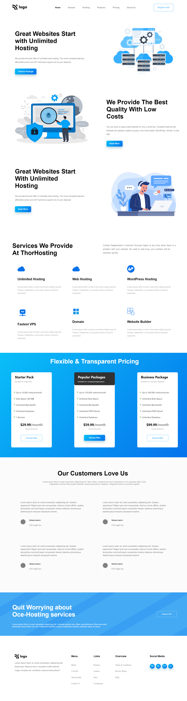
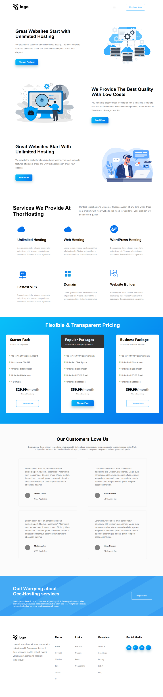
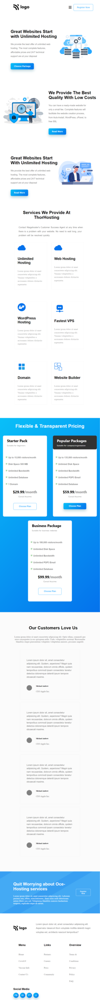
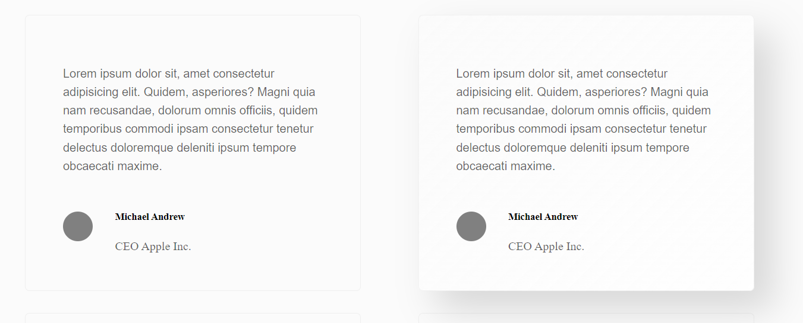

# Hosting Service Landing Page

## Time Taken - about 5 hours

***

## Website Link:
### [Project Link](https://aryansharma15.github.io/hosting_service_landing/)

## Tech Stack Used

 

***

## Full Screen View

 

***

## Second View - 1280px

 

***

## Mobile View - 768px

 

***

## Hover Functionality

 

Different elements were lent the `:hover` attribute to enhance the UI of the webpage.

<!--   -->
1. Review Cards

 

2. Register Button

    1. Before

    
    
    2. After

    

 

3. Choose Plan Button

    1. Before

    

    2. After

    

